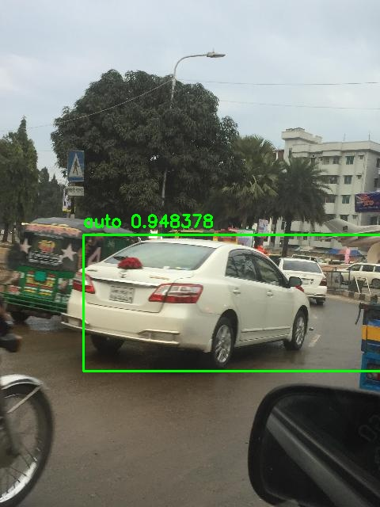
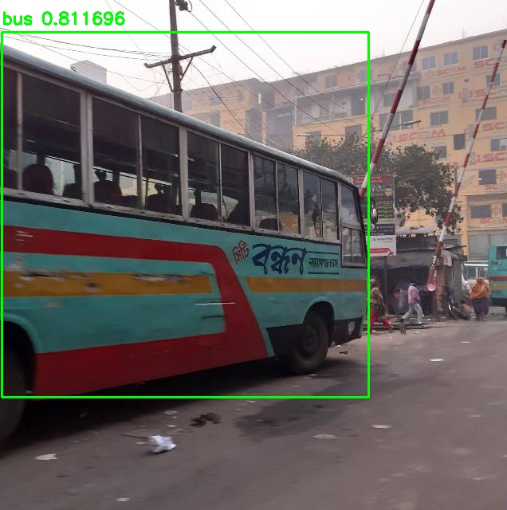
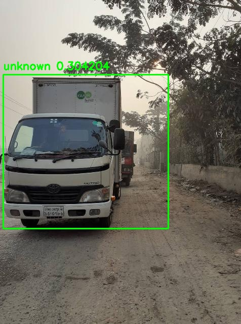

# Airport Parking — Vehicle Classification Prototype

A C++ computer-vision prototype that classifies vehicles from images into billing categories (**auto, moto, camionnette, bus**), built as a proof-of-concept for a class-based dynamic pricing system in airport parking.

> **Status:** Personal proof-of-concept. This project validates the end-to-end pipeline (image → inference → classification → export). It is **not** a production system — see [Limitations & Next Steps](#limitations--next-steps).

---

## Results

The prototype runs a YOLO object-detection model via ONNX Runtime and maps its output to four business categories. Sample annotated outputs:

| Car → `auto` | Bus → `bus` | Truck → `unknown` |
|:---:|:---:|:---:|
|  |  |  |
| conf. 0.95 | conf. 0.81 | conf. 0.30 — flagged low-confidence |

Each run also exports a CSV summary:

| image_name | vehicle_type | confidence | processing_time_ms | status |
|---|---|---|---|---|
| image1.jpg | auto | 0.95 | 90 | success |
| image2.jpg | auto | 0.93 | 87 | success |
| image3.jpg | bus  | 0.81 | 87 | success |
| image4.jpg | unknown | 0.30 | 86 | low_confidence |
| test.jpg   | auto | 0.95 | 84 | success |

The third example is intentional: a truck falls below the confidence threshold and is correctly flagged `low_confidence` rather than mis-billed. Handling uncertain predictions safely is part of the design.

---

## How It Works

```
Input image
  → OpenCV load & preprocess (resize 640×640, normalize)
  → ONNX Runtime inference (YOLO, 21 classes)
  → Map to business category (auto / moto / camionnette / bus)
  → Confidence-threshold check
  → CSV export + annotated image + log entry
```

The model detects 21 fine-grained vehicle classes; a mapping layer collapses these into the four categories the pricing logic needs. Predictions below the configured confidence threshold are labelled `unknown` so they can be reviewed rather than charged incorrectly.

---

## Tech Stack

- **Language:** C++17
- **Inference:** ONNX Runtime
- **Image processing:** OpenCV 4.12
- **Build:** CMake
- **Model:** YOLO (exported to ONNX)
- **Config:** JSON

---

## Project Structure

```
airport_parking_classifier/
├── config/        # config.json (paths, thresholds)
├── include/       # header files
├── src/           # implementation
├── examples/      # sample annotated results
├── CMakeLists.txt
└── README.md
```

---

## Build & Run

**Prerequisites:** CMake ≥ 3.15, a C++17 compiler, ONNX Runtime, and OpenCV installed. Update the paths in `CMakeLists.txt` to match your ONNX Runtime and OpenCV locations.

```bash
mkdir build && cd build
cmake ..
cmake --build . --config Release
./airport_parking_classifier      # Windows: Release\airport_parking_classifier.exe
```

Paths, confidence threshold, and image size are set in `config/config.json`:

```json
{
  "model_path": "../models/model.onnx",
  "input_folder": "../input_images",
  "output_csv": "../output/results.csv",
  "output_folder": "../output",
  "confidence_threshold": 0.50,
  "image_size": 640
}
```

> **Note:** the trained model (`model.onnx`) is not included in this repo. See [Model & Data](#model--data) below for how to obtain or reproduce it.

---

## Model & Data

The prototype model was trained on the **Road Vehicle Images Dataset** by Ashfak Yeafi (2021), a set of ~3,000 annotated Bangladeshi road-traffic images across 21 vehicle classes.

- Dataset: https://www.kaggle.com/datasets/ashfakyeafi/road-vehicle-images-dataset
- License: Database Contents License (DbCL) v1.0

Because the training images are general street scenes from a different context, the model is suitable only for **pipeline validation**. A production version would be retrained on real images from the target cameras.

---

## Oracle Integration (Planned)

In the intended deployment, images are stored in an Oracle database as `LONG RAW`. The `OracleImageReader` module is scaffolded for this flow:

```
Oracle LONG RAW  →  image bytes  →  OpenCV Mat  →  ONNX inference  →  CSV / API
```

Connection details, table structure, and credentials are required before this is implemented — so this layer is defined but not active in the prototype.

---

## Limitations & Next Steps

This is a deliberate proof-of-concept, and it's useful to be clear about what it does and doesn't do:

- **Model is context-mismatched.** Trained on public Bangladeshi street data, not the target environment — accuracy on real conditions would differ and requires retraining.
- **Oracle layer is scaffolding only.** The reader module exists but is not connected to a live database.
- **No automated tests yet.** Validation so far is manual, against sample images.
- **Single-image sequential processing.** No batching or real-time video pipeline.

Planned directions: retrain on real camera data, implement the Oracle `LONG RAW` reader, add automated tests, and integrate the pricing/billing step.

---

## About

Personal project exploring the integration of a computer-vision classifier into a real-world billing workflow. The interesting problem here is less the classification itself and more connecting a model cleanly into existing infrastructure (database, cameras, pricing) — which is where most of the design effort went.

Author: **Khalil Khammari**
